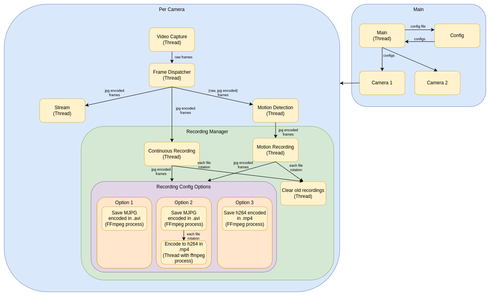

# Sentinel-Python

<div align="center">
  
</div>

A multi-camera video streaming and recording system in Python, supporting real-time streaming via Flask, continuous and motion-triggered recording, and flexible configuration via YAML. Designed to be efficient and lightweight for low-power devices such as the Raspberry Pi Zero 2W

## Features

- **Multi-camera support**: Configure and manage multiple cameras.
- **Real-time streaming**: MJPEG streaming over HTTP using Flask.
- **Continuous recording**: Save video streams to disk, with hourly file rotation.
- **Motion detection**: Detect motion events and record only when motion is detected.
- **Configurable encoding**: Save recordings as MJPG `.avi` or H264 `.mp4` (hardware/software encoding).
- **Automatic cleanup**: Old recordings are deleted based on retention policy.
- **Logging**: Rotating log files with configurable size and retention.
- **Easy configuration**: All settings managed via a single YAML file.
- **Efficient and lightweight**: Optimized for low-power hardware like the Raspberry Pi Zero 2W.

## Softwares Used

- Python
- FFmpeg
- OpenCV
- Flask
- PyYAML

## Quick Start

1. **Install Python and FFmpeg**

   Install Python and FFmpeg on your system. Make sure FFmpeg is in PATH.
   - This project was developed and tested using Python 3.12.11, but it may also work with previous or later versions.
   - This project was developed and tested using FFmpeg version 6.1.1, but other versions may also work.

2. **Install dependencies**

   > **Note:** If you are using a virtual environment, make sure it is activated before running the following commands.

   ```sh
   pip install -r requirements.txt
   ```

3. **Edit the configuration**

   Edit `src/config.yaml` to set up your cameras, recording, motion detection, and logging preferences.
   See the [Configuration](#configuration) section below for detailed guidance on all available options.

4. **Run the application**

   ```sh
   cd src
   python main.py
   ```

5. **Access camera streams**

   Open your browser and go to `http://<your-local-ip>:<port>` for each camera (see `port` in your config).

6. **Stop the application**

   Type `exit` or `q` in the terminal to gracefully stop all cameras and processes.

## Configuration


All settings are managed in `src/config.yaml`. Key sections and options:

- **Cameras**: Configure each camera by ID. Set device path, name, stream port, target FPS, stream quality, and optionally pixel format, resolution, and source FPS. Example:
  - `camera`: Device path (e.g., `/dev/video0`)
  - `name`: Friendly name for the camera
  - `target_fps`: FPS for streaming and Recording (should be ≤ camera's max FPS)
  - `port`: HTTP port for streaming
  - `stream_quality`: JPEG quality (0–100)
  - `show_fps`: Overlay FPS on stream (True/False)
  - `source_format`, `width`, `height`, `source_fps`: Optional, for advanced camera tuning

  > **Tip:** On Linux, you can list the supported `source_format`, `width`, `height`, and `source_fps` for your camera using:
  > ```sh
  > v4l2-ctl --device=/dev/video0 --list-formats-ext
  > ```
  > Replace `/dev/video0` with your camera device if needed.

- **Recordings**: Control continuous recording for all cameras.
  - `save`: Enable/disable continuous recording
  - `directory`: Where to save recordings (relative to config location or absolute path)
  - `max_days_to_save`: Retention period (days)
  - `encode_to_h264`: Recording mode:
    - 0: Save MJPG `.avi` (no encoding)
    - 1: Save MJPG `.avi`, then convert to H264 `.mp4` after each hour
    - 2: Save directly as H264 `.mp4` (encoding)
  - `h264_encoder`: Encoder to use. Recommended to use hardware acceleration if possible, otherwise use `libx264`.
  - `bitrate`: H264 bitrate (kbps)

  > **Tip:** To see which H.264 encoders your FFmpeg installation supports (including hardware acceleration options), run:
  > ```sh
  > ffmpeg -hide_banner -encoders | grep 264
  > ```
  > Choose an encoder supported by your device for best performance.

- **Motion**: Configure motion-triggered recording and detection per camera.
  - `directory`: Where to save motion recordings
  - `max_days_to_save`: Retention period (days)
  - `encode_to_h264`, `h264_encoder`, `bitrate`: Same as above, but for motion events
  - Per-camera options (under each camera ID):
    - `enabled`: Enable motion detection for this camera
    - `noise_level`: Pixel change threshold (1–255). Distinguishes noise from motion at pixel level.
    - `pixel_threshold`: % of pixels that must change to trigger motion
    - `object_threshold`: % of frame area a moving object must cover to trigger motion
    - `minimum_motion_frames`: Frames in a row with motion to start motion event
    - `pre_capture`: Frames to save before motion starts
    - `post_capture`: Frames to save after motion ends
    - `event_gap`: Seconds to wait before ending motion event after last post_capture frame.

    > **Note:** A motion event groups together all triggered motion detections (including pre_capture and post_capture frames) that occur within the same period under the same motion recording file. If a new motion is triggered before the `event_gap` time has elapsed after the previous triggered motion (including its post_capture), both will be saved in the same motion recording file. This ensures closely spaced motion triggers are combined into a single media file.

- **Logs**: Configure logging behavior.
  - `save`: Enable/disable log saving
  - `directory`: Where to save logs
  - `max_size`: Max log file size (MB)
  - `max_files`: Max number of log files to keep (rotating)

See the sample `src/config.yaml` for more details and inline comments.

## File Locations

- **Continous Recordings**: Saved in the directory specified in the config (e.g., `../data/recording`).
- **Motion-Triggered Recordings**: Saved in the directory specified in the config (e.g., `../data/motion`).
- **Logs**: Saved in the directory specified in the config (e.g., `../logs`).

## Modules

- **Main**: The main entry point that initializes modules, starts the application, and coordinates the overall workflow.
- **Config**: Handles loading and validation of all configuration settings from the YAML file, making them accessible throughout the application.
- **Cameras**: Manages camera initialization, video capture, resource management for multiple camera devices and frame distribution for the other modules.
- **Stream**: Provides real-time MJPEG streaming over HTTP using Flask, allowing live video feeds from each camera.
- **Motion**: Implements motion detection logic, triggering recording events when movement is detected in the video stream.
- **Recording**: Manages continuous and motion-triggered video recording, file rotation, encoding, and retention policies.

## Architecture

